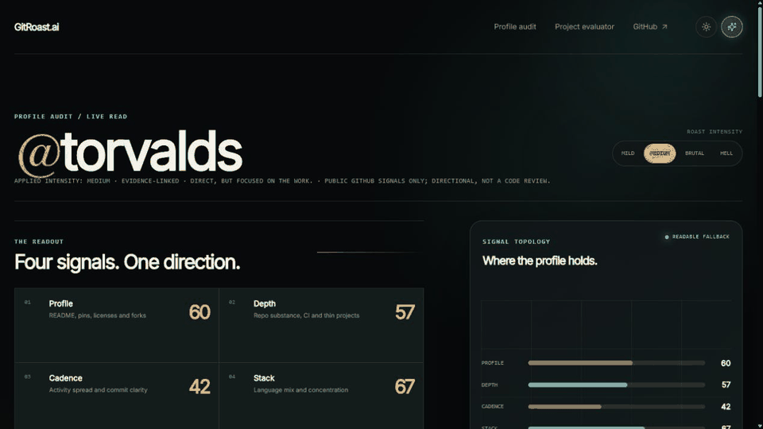

# GitRoast.ai

Rule-based GitHub profile audits with deterministic scoring, local roast generation, and shareable profile cards.

GitRoast fetches real README, pinned-repository, language, commit, license, and repository-structure signals from GitHub. Each score is paired with visible evidence, and the cohort rank is calculated from persisted audits with an explicit cold-start sample count.

## See the evidence



Actual live results: a profile audit of [@torvalds](https://github.com/torvalds), then an evidence-linked evaluation of this repository. The animation shows the outputs users receive—not a mockup.

> This repository is public for transparency and portfolio review. It is proprietary software; see [License](#license--permitted-use) before copying, reusing, distributing, or deploying any part of it.

## Links

| Service | Link | Verified status |
| --- | --- | --- |
| Source | https://github.com/NoorRattan/GitRoast.ai | Repository source |
| Frontend | https://gitroast-ai-frontend.jnoorrattan.workers.dev | Live on Cloudflare Workers |
| API gateway | https://gitroast-api-gateway-preview.jnoorrattan.workers.dev/api/v1/health | Public API entry point |
| Backend health | https://gitroast-ai.onrender.com/health | Live on Render |
| Example card image | https://gitroast-card-preview.jnoorrattan.workers.dev/card/torvalds.png?v=1 | Live on the card preview worker |
| Production verification | docs/production-verification.md | Checked-in deployment notes |
| Population baselines | docs/signal-baselines.md | Evidence-based finding-baseline policy |
| Card cache verification | workers/card/CACHE_KEY_VERIFICATION.md | Checked-in cache-key verification notes |

## Deployment Notes

- The Cloudflare frontend dashboard should use `npm run build:cloudflare` and `npm run deploy:direct`.
- The frontend is intentionally deployed on workers.dev; no frontend custom domain is configured in this repo.
- The backend and full end-to-end audit flow still depend on a live Render service with production environment variables.
- Copy `.env.example` for the complete local/frontend/backend variable contract; never commit real values.
- Render applies Alembic migrations before startup. Cloudflare deploys can run from CI after the required GitHub production secrets are configured.
- Current intentional architecture decisions are documented in `docs/architecture-decisions.md`.

## Public Release Safety

- Real credentials are never committed. Copy `.env.example`, supply your own values locally, and keep `.env` / `.dev.vars` untracked.
- Production values belong only in Render and GitHub's protected `production` environment. Required deployment secrets are `CLOUDFLARE_API_TOKEN`, `CLOUDFLARE_ACCOUNT_ID`, `GATEWAY_SHARED_SECRET`, and `RENDER_DEPLOY_HOOK`.
- Before changing repository visibility, enable GitHub secret scanning, push protection, Dependabot alerts/security updates, and private vulnerability reporting in the repository security settings.
- Browser API traffic goes through the Cloudflare gateway. The card Worker calls the protected Render card-data endpoint server-to-server with its configured gateway secret. The Render origin accepts only `/health` publicly; protected routes require that secret.
- Before publishing a fork or deployment, rotate any credential that may have appeared in a terminal, chat, issue, commit, or build log.
- Please report security concerns privately as described in [SECURITY.md](SECURITY.md). Do not include secrets in public issues.

## Local Verification

```powershell
npm ci
python -m pip install -e ".[test]"
npm run lint
npm run test:frontend
python -m pytest -q
npm run build
npm run bundle:check
```

Card Worker checks run from its package directory:

```powershell
cd workers/card
npm ci
npm run typecheck
npm test
```

## License & Permitted Use

Copyright © 2026 Noor Rattan. All rights reserved.

This repository is source-visible, not open source. You may view it for evaluation and portfolio review only. You may not copy, reproduce, modify, distribute, sublicense, commercialize, deploy, or create derivative works from any part of this project without prior written permission. See [LICENSE](LICENSE).
